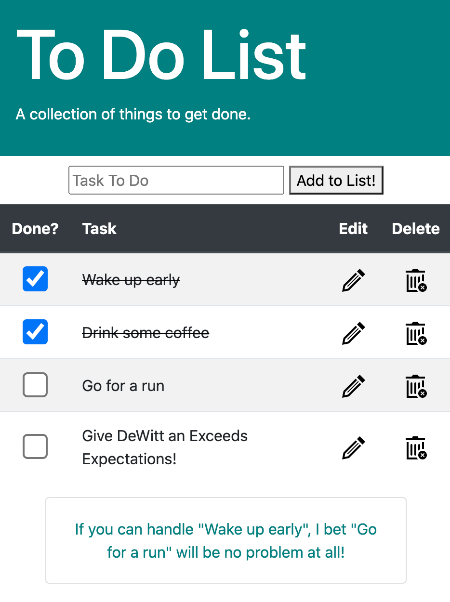
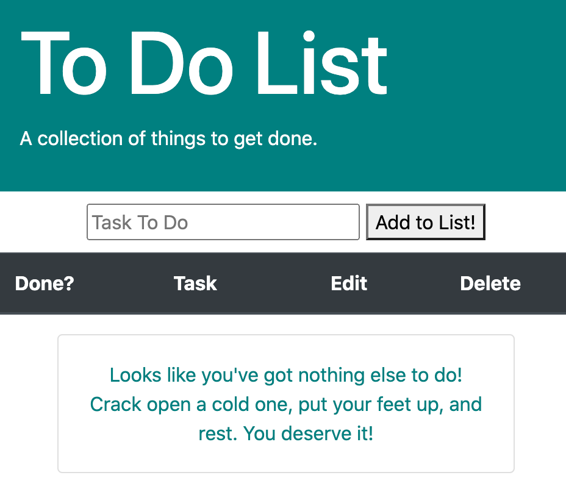

# Full Stack To Do List
## Description

My goal for this project was to create an app that would store tasks in a database and display them dynamically in the interface. All of the tasks the user adds are stored on the database until they decide to delete them.  The UI has easy to recognize symbols to use as buttons and is uncluttered for ease of use.  

This app is also features motivational quotes based around what tasks the user inputs.  Never again will you feel unmotivated to get your to do list done!

## Screen Shots

## Built With

- Javascript
- jQuery
- node.js
- express
- PostgreSQL

## Acknowledgement

Thanks to all the cool beans in the Rabin cohort at Prime!

## Support

If you have issues or suggestions, please email me at [dewitt.kane@gmail.com].
